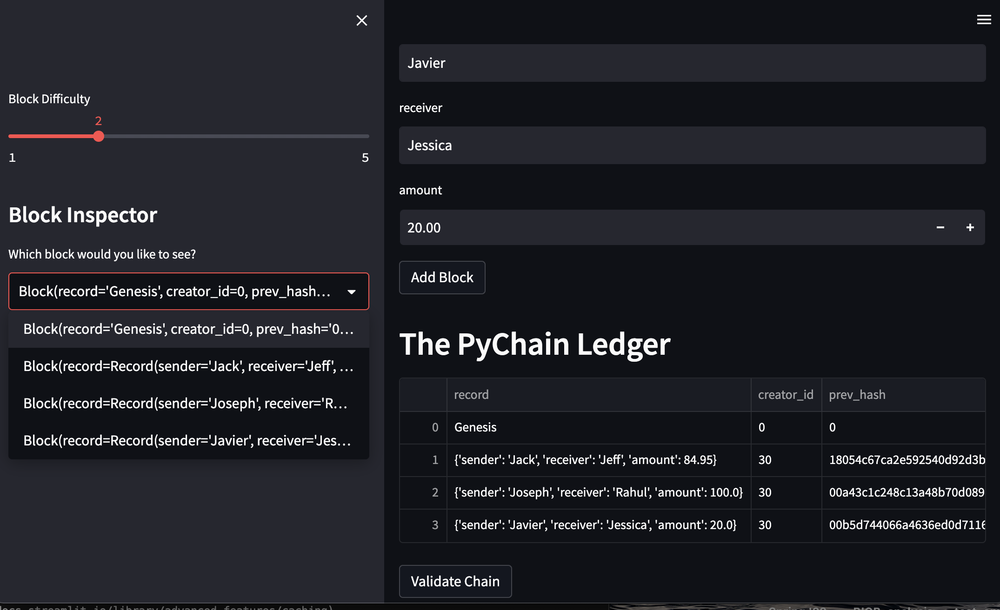

# M18_Ledger


## Background

This is a ledger based system which , with a user friendly interface. Where one record transactions between senders and receivers, one can also see the amount which was transacted.

## Technologies
- streamlit
- Pandas
- Hashlib


## Installation
First, One must Clone this Repository

Then they must activate their dev environment, Click [here](https://docs.conda.io/projects/conda/en/stable/user-guide/install/macos.html)
for detailed instructions.


```
pip install streamlit
```
See Multiple Blocks in image below



See below for the Validity of the blockchain.


## Contributors

Cary Gutknecht, Jay Ferreira, Google

## License
